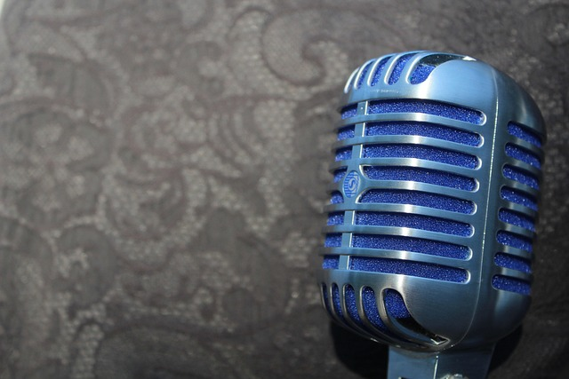
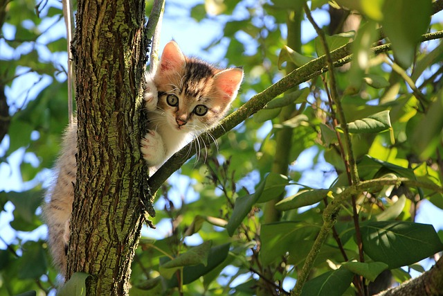

# 🎸 Urban Engine Podcast Test: The Blues Edition

Welcome to the Urban Engine Podcast Test repository, where we dive deep into the soulful, sometimes hilarious world of the blues. If you thought blues was all about heartbreak and lost dogs, you’re in for a treat (and maybe a laugh).

---

## What Are the Blues?

The blues is a musical genre, a feeling, and sometimes just what you get when your WiFi goes down on deadline day. Originating in the Deep South, the blues has evolved into a cultural phenomenon that now includes memes, cat videos, and even podcasts like ours!

---

## The 12-Bar Blues: Simpler Than Your Ex’s Excuses

If you can count to 12 and remember 3 chords, you’re already halfway to blues stardom. Just don’t forget to make a face like you just stepped on a LEGO.

---

*The "I forgot the lyrics" blues look.*

---

## Why Are Blues Songs Always Sad?

Because someone stole the cookies, left the fridge open, or used up all the toilet paper. But here’s the secret: the sadder the lyrics, the happier the crowd. It’s like reverse psychology for your ears.

---

*This cat has heard too much jazz and now he's got the blues.*

---

## The Top 3 Blues Moves

1. Sigh dramatically before strumming a chord.
2. Sing about losing your keys, your job, or your favorite sock.
3. End every song with “baby, please.”

---

## Famous Blues Links (for More Laughs & Learning)

- [The Blues Foundation](https://blues.org/)
- [Funny Blues Memes](https://www.pinterest.com/bluesmemes/)
- [History of the Blues](https://www.britannica.com/art/blues-music)

---

## Podcast Sneak Peek

Our podcast features guests who claim to have invented the kazoo, blues musicians who only play in minor keys, and stories about harmonicas lost in mysterious places.

---

*Blues harmonica: because sometimes you just need to whistle your problems away.*

---

## How to Join the Blues

Fork this repo, add your funniest blues anecdote, and send us a pull request. Bonus points if you rhyme!

---

Keep strumming, keep laughing, and always remember: even the saddest song can bring the brightest smile.
